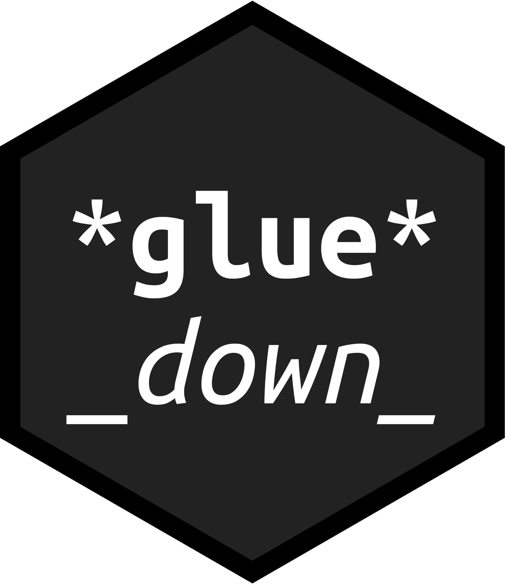

<!-- README.md is generated from README.Rmd. Please edit that file -->

# gluedown 

<!-- badges: start -->

[](https://lifecycle.r-lib.org/articles/stages.html#maturing)
[](https://CRAN.R-project.org/package=gluedown)

[](https://app.codecov.io/gh/kiernann/gluedown?branch=master')
[](https://github.com/kiernann/gluedown/actions)
<!-- badges: end -->

The goal of `gluedown` is to ease the transition from R’s powerful
vectors to formatted markdown text. The package uses
[`glue()`](https://github.com/tidyverse/glue) to wrap character vectors
in markdown syntax. With the [`knitr`](https://github.com/yihui/knitr)
package, users can print the formatted vectors directly to the body of a
markdown document.

## Installation

Install the release version from
[CRAN](https://cran.r-project.org/package=gluedown):

``` r
install.packages("gluedown")
```

The development version can be installed from
[GitHub](https://github.com/kiernann/gluedown):

``` r
# install.packages("remotes")
remotes::install_github("kiernann/gluedown")
```

## Usage

``` r
library(gluedown)
library(stringr)
library(rvest)
```

Use the `results='asis'` chunk option to print the formatted output to
the body of a document.

```` markdown
```{r results='asis'}
md_order(x = c("Legislative", "Executive", "Judicial"))
```
````

1.  Legislative
2.  Executive
3.  Judicial

### Lists

Printing vectors as markdown lists was the initial inspiration for the
package. Here, we use five different functions to create five elements
of a new vector.

``` r
inlines <- c(
  md_bold("Alabama"),
  md_code("Alaska"),
  md_link("Arizona" = "https://az.gov"),
  md_italic("Arkansas"),
  md_strike("California")
)
print(inlines)
#> [1] "**Alabama**"               "`Alaska`"                 
#> [3] "[Arizona](https://az.gov)" "_Arkansas_"               
#> [5] "~~California~~"
```

Then we can print that new vector as a list, including the inline
formatting.

``` r
md_bullet(inlines)
```

- **Alabama**
- `Alaska`
- [Arizona](https://az.gov)
- *Arkansas*
- ~~California~~

### Inline

You can also use `gluedown` to format R [inline code
results](https://rmarkdown.rstudio.com/lesson-4.html).

``` r
name <- sample(state.name, size = 1)
abb <- state.abb[match(name, state.name)]
# `r md_bold(name)`
# `r md_italic(abb)`
```

In this case, our randomly selected state is **Maine**, which has the
abbreviation *ME*.

### Pipes

All functions are designed to fit within the tidyverse ecosystem and
work with [pipes](https://magrittr.tidyverse.org/reference/pipe.html).

``` r
read_html("https://w.wiki/A58") %>% 
  html_node("blockquote") %>% 
  html_text(trim = TRUE) %>% 
  str_remove("\\[.*\\]") %>% 
  md_quote()
```

> We the People of the United States, in Order to form a more perfect
> Union, establish Justice, insure domestic Tranquility, provide for the
> common defence, promote the general Welfare, and secure the Blessings
> of Liberty to ourselves and our Posterity, do ordain and establish
> this Constitution for the United States of America.

### Extensions

The package primarily uses [GitHub Flavored
Markdown](https://github.github.com/gfm/), with support for useful
extensions like [task
lists](https://help.github.com/en/articles/about-task-lists).

``` r
legislation <- c("Houses passes", "Senate concurs", "President signs")
md_task(legislation, check = 1:2)
```

- [x] Houses passes
- [x] Senate concurs
- [ ] President signs

## Contribute

Please note that the `gluedown` project is released with a [Contributor
Code of
Conduct](https://kiernann.github.io/gluedown/CODE_OF_CONDUCT.html). By
contributing to this project, you agree to abide by its terms.

<!-- links: start -->
<!-- links: end -->
